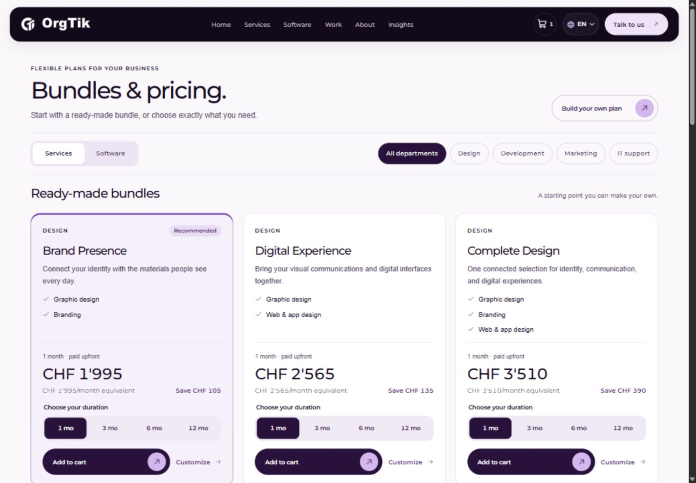
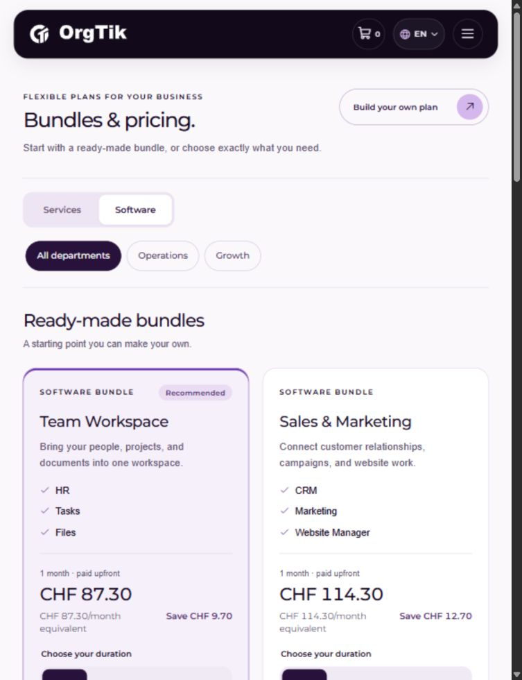
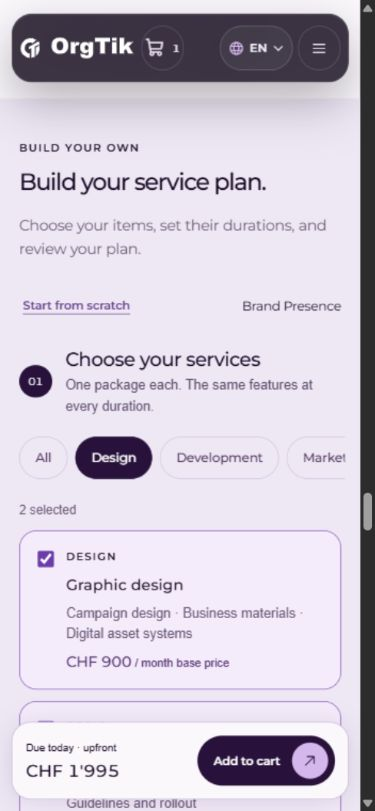
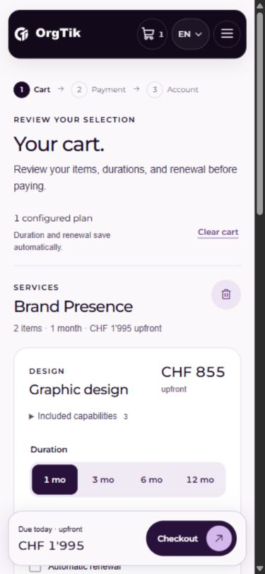
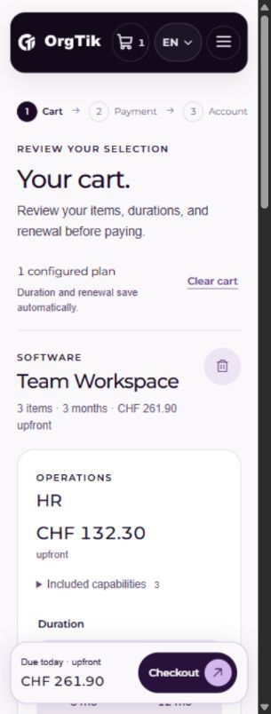
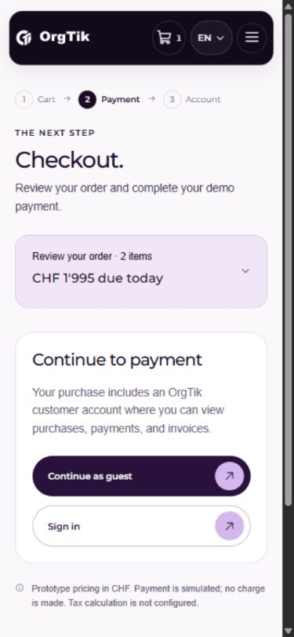
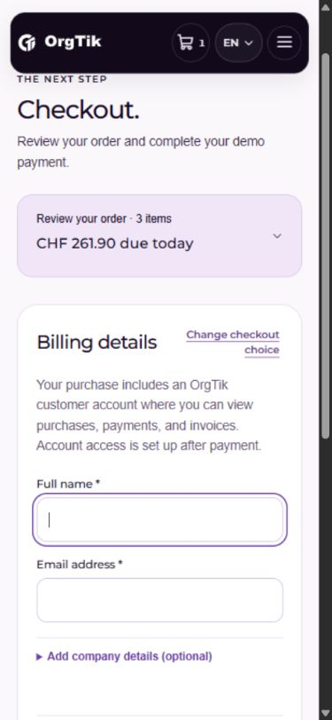
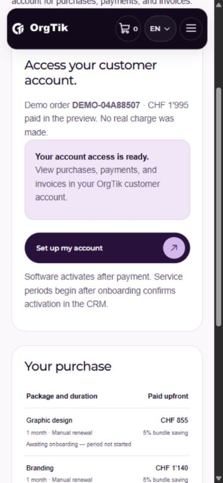

# Purchasing design corrections — 2026-10-01

Follow-up to the user's report of remaining design issues. Reviewed the existing local app in the in-app browser, captured current states, and corrected the shared purchasing components. OrgTik's palette, Montserrat typography, official assets, and circular-arrow pill actions are retained.

## 1. Pricing directory and bundles — corrected

The original layout showed a mismatched rectangular background, a repeated introduction, two similar filter rows, and low-priority prices. The directory now has one warm background, a compact heading/action row, a distinct Services/Software switch, and separate department filters. Shorter package names make inclusion lists easier to compare. Bundle cards align their headings, price blocks, duration controls, and actions. Full-period upfront amounts lead; monthly equivalents and savings remain visible. Card actions advance to View in cart after adding.

[Desktop before](01-plans-before.jpg) · [Mobile before](01-plans-mobile-before.jpg)

## 2. Builders — clearer controls

Department filters use a compact horizontal row on mobile. Item names and capabilities are easier to scan; redundant introductory copy is shorter. Shared and individual duration controls use a consistent segmented treatment. Visible month abbreviations retain full accessible month and discount labels. Renewal controls keep item-specific accessible names and show the interval and amount underneath the visible label.

[Before](02-builder-before.jpg)

## 3. Cart — compact and usable

The plan count and Clear cart action share a toolbar. Remove-plan controls fit the mobile group header. Duration choices remain readable in narrow cards, and the dock uses a single-line Checkout action. Fixed action height and spacing are consistent with the brand's circular-arrow controls.

Checked live totals, ArrowRight radio navigation, Undo, and Cancel. Checkout stayed disabled while a content draft was open. The revised software card's View in cart action retained its three-month selection and CHF 261.90 total.

[Before](03-cart-before.jpg)

## 4. Checkout — less repetition

The header is shorter, the order review precedes billing, and the account-choice panel has a concise heading. Billing's title and change-choice action share a row. Required fields, optional company details, demo-payment notice, and payment action remain available.

[Before](04-checkout-before.jpg)

## 5. Confirmation — verified

Completed a synthetic guest purchase after the changes. It reached the account-setup action with the correct CHF 1,995 total. The receipt retained manual renewal and the service onboarding/activation state. Account access still uses the existing labeled CRM preview.

## Checks and limits

- All 31 pricing, catalog, cart, storage, payment, and CRM tests passed.
- Source formatting, production build, and Git whitespace checks passed.
- Inspected 320, 390, 768, and 1440px layouts. Measured no document-level horizontal overflow at each width. Final browser error/warning check was empty.
- Verified native radio keyboard interaction and draft checkout protection. This is a visual and interaction review, not a complete screen-reader or WCAG audit.
- Screenshots are current-run browser captures, saved and inspected. Flow states and scroll positions are representative rather than a pixel-aligned regression suite.
- Payment, authentication, and CRM remain simulated; this pass introduces no real charge, account, email, invoice, or backend integration.
