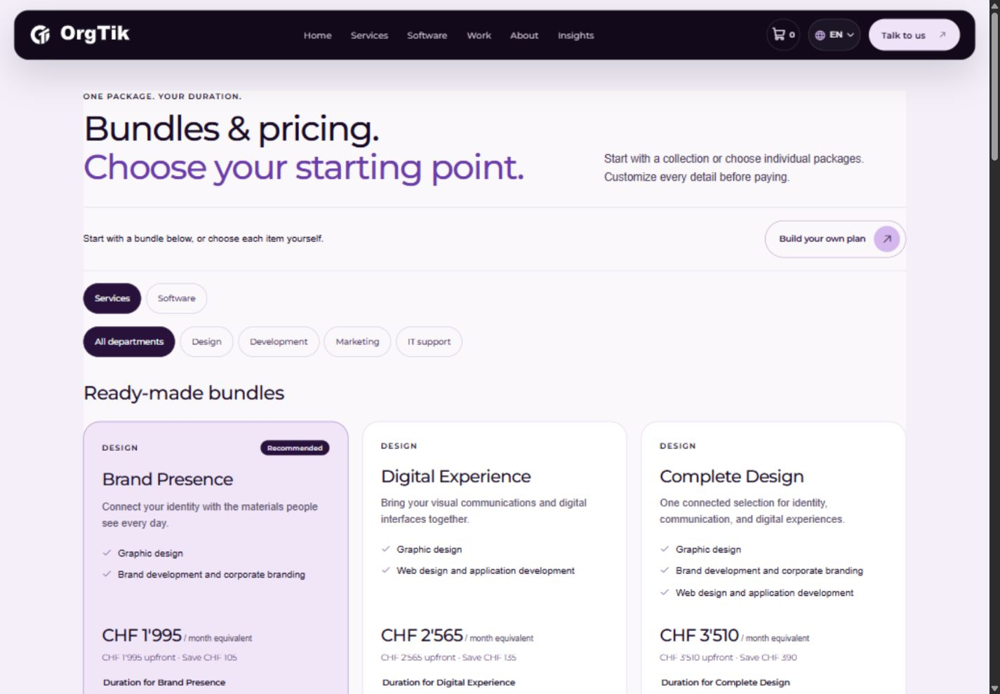
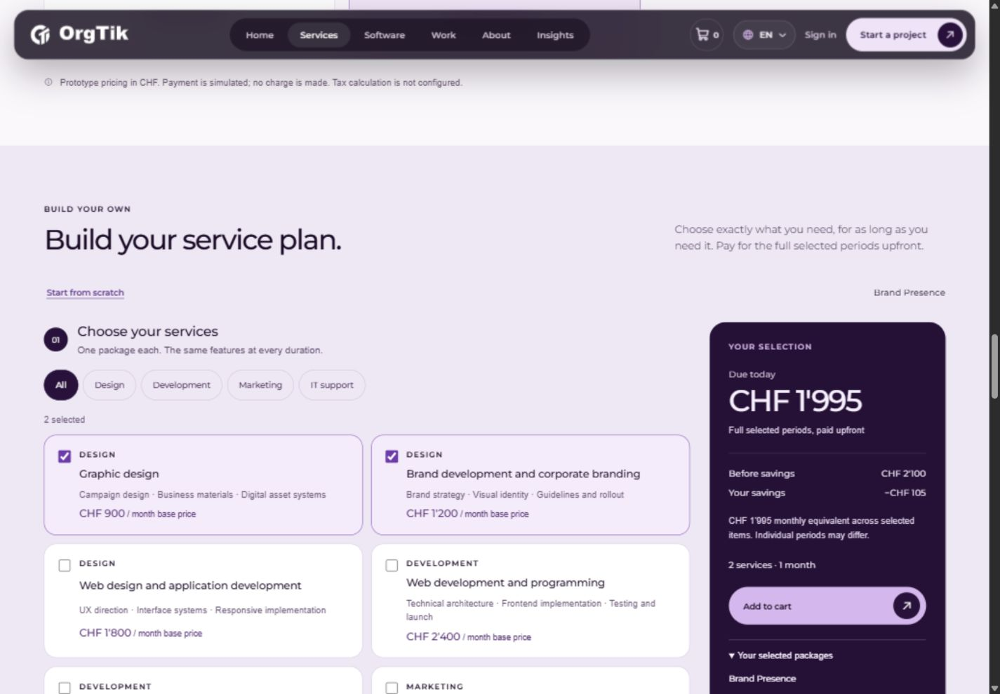
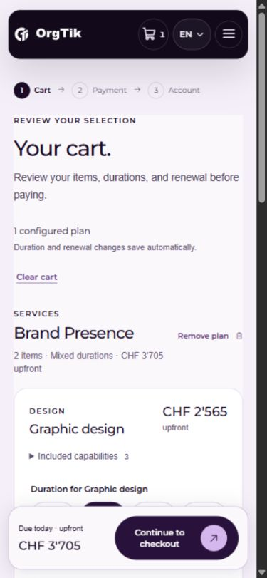
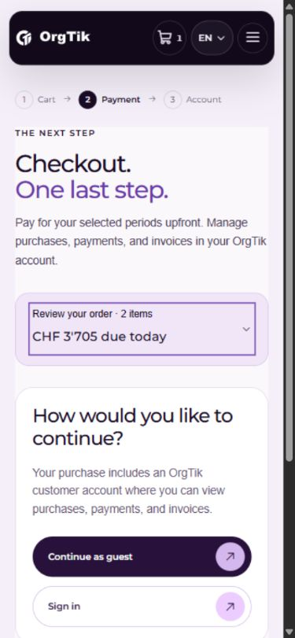
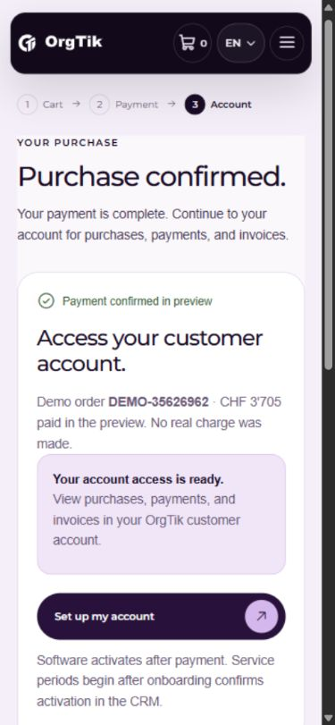

# Purchasing journey review — 2026-10-01

Reviewed and refined the local OrgTik frontend at `http://127.0.0.1:5173`. The intended journey is choose → customize → cart → pay → CRM account access. This review follows the approved frontend prototype scope. All purchases and identities used for verification were synthetic.

## 1. Discover a starting point — improved

**Observed:** The directory's oversized introduction delayed browsing, and building a custom plan required finding a footer action. **Changed:** A compact introduction and explicit “Build your own plan” action appear before bundle filters and cards. Services and Software remain separate views; bundle recommendations explain coverage.

[Before, desktop](01-discovery-before.jpg) · [After, desktop](01-discovery-after.jpg)

## 2. Configure a plan — improved

**Observed:** The summary exposed a count without an easy way to scan selected names. After adding, the primary control could remove the selection rather than advance the journey. **Changed:** Selection comes first, followed by the shared duration and individual overrides. The sticky summary lists each selected item, term, renewal, and price. Add becomes View in cart. A mobile action bar follows the builder while its section is visible. Starting another configuration resets department filters.

**Checked:** Customized Brand Presence; filtered to Marketing while retaining two hidden Design selections; changed Graphic design to three months; declined a proposed shared six-month replacement. The mixed selection remained CHF 3,705 and reached the cart unchanged through the mobile action bar.

[Before, desktop](02-builder-before.jpg) · [After, desktop](02-builder-after.jpg)

## 3. Review and edit the cart — improved

**Observed:** Repeated capabilities and a long introduction obscured editing; mobile checkout required substantial scrolling. Checkout could leave unsaved content edits behind. **Changed:** Shorter introduction, capabilities in native disclosures, explicit autosave guidance, persistent mobile total/checkout, and a draft amount beside Save/Cancel. Checkout is unavailable until all content edits are resolved. Beginning an edit clears the prior notification, fixing a mobile overlap that initially covered Save.

**Checked:** Added a third service in a draft: draft CHF 5,130, saved cart CHF 3,705, checkout disabled. Cancel restored the original and focus returned to Customize contents. Save committed CHF 5,130; Undo restored CHF 3,705. Refresh preserved it. Renewal toggling and Undo worked. A software bundle retained CHF 87.30 and its individual amounts; HR renewal remained visible.

[Before, desktop](03-cart-before.jpg) · [Before, mobile](03-cart-mobile-before.jpg) · [After, desktop](03-cart-desktop-after.jpg) · [After, 320px](03-cart-320-after.jpg)

## 4. Pay with confidence — improved

**Observed:** Mobile order details followed the billing form; optional company input competed with required fields. **Changed:** An expandable order review and upfront total precede checkout choices on mobile/tablet. Company details use an optional disclosure. Summary controls have visible keyboard focus; the edit link has readable contrast and a comfortable target.

**Checked:** Guest validation focused the missing name. Declined and cancelled demo payments both preserved the CHF 3,705 cart. Guest success entered account setup. Demo sign-in retained the CHF 87.30 software selection, its line amounts and HR renewal. The order disclosure worked with Enter; tablet review showed all three software lines.

[Before, mobile](04-checkout-before.jpg) · [After, tablet](04-checkout-768-after.jpg)

## 5. Access the CRM account — improved

**Observed:** Vague confirmation headings weakened the distinction between completed payment and account access. **Changed:** Explicit purchase confirmation, a payment status marker, and a direct account-access heading lead to the appropriate setup or account action.

**Checked:** A successful guest purchase with failed CRM setup survived refresh. Retrying setup reached the account action without payment. The handoff withheld access until simulated email verification; Escape returned focus to the trigger. A signed-in software purchase with pending setup reached “Go to my account” after checking setup. Its receipt showed active software, HR renewal on, and manual renewal for Tasks/Files. Service receipts showed onboarding pending and periods not started.

[Before, mobile](05-account-before.jpg)

## Verification and limits

- 31 automated pricing, catalog, cart, migration, payment, and CRM tests pass. Added malformed cross-tab migration-message coverage; invalid messages no longer break cart rendering.
- Source formatting, production build, and whitespace checks pass.
- Visually inspected 320, 390, 768, and 1440px layouts. Measured no horizontal overflow at the 320px cart, 768px checkout, and 1440px cart (305/753/1425px client widths, excluding scrollbar). The earlier acceptance pass also measured every requested width.
- Checked keyboard order-disclosure activation, native radio controls, validation focus, draft focus return, modal Escape, and focus restoration. Final browser error/warning log was empty.
- Broader duplicate-resolution, cross-builder cart, legacy links, Hosting exclusion, and migration coverage is recorded in [the initial acceptance pass](../purchasing/README.md) and automated tests.
- This is a browser and code review, not a usability study or complete screen-reader/WCAG audit. Payment, sign-in, CRM setup, and verification are simulations. The CRM URL remains unset; no real account, email, invoice, or charge was created. Production pricing and payment authority remain server-side integration work.

All screenshots in this folder were captured from this review's local run and visually inspected after saving. Before/after views use representative journey states; they are not pixel-aligned comparisons of identical scroll positions.
